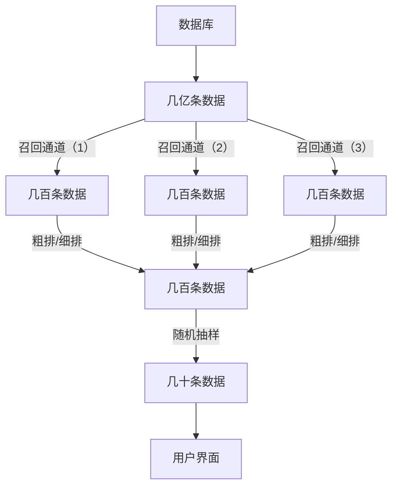
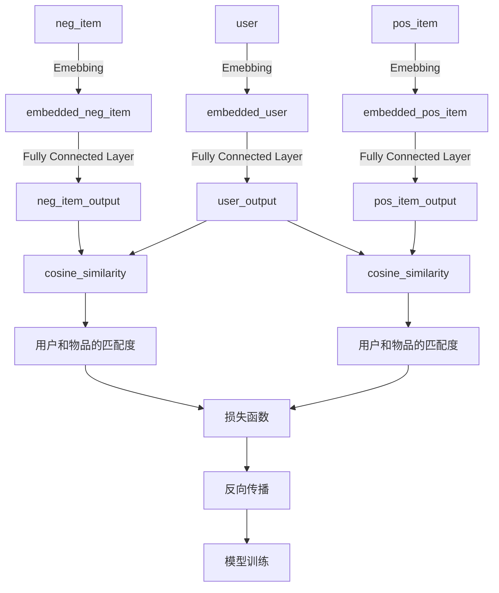

# 推荐系统设计

---
## 一、认识推荐系统


### 1、衡量推荐系统和和好坏的标准：北极星指标。

什么是北极星指标：北极星指标（North Star Metric），也叫作第一关键指标（One Metric That Matters），是指在产品的当前阶段与业务/战略相关的绝对核心指标，一旦确立就像北极星一样闪耀在空中，指引团队向同一个方向迈进（提升这一指标）。

主要北极星指标
- 日活数（DAD）/月活数（MAU）：每一个不同的用户使用一次系统，就记作一个日活数，同理对于月活数
- 消费（广义）：使用系统的时长，消费数额等
- 发布：用户的发布作品的数量


### 2、推荐系统基本流程


召回是为了快速减少数据量，方便后续筛选。

粗排和细排通过ai模型等快速对数据打分，粗派使用简单模型，减少时间，精排用复杂模型，提高精度，最后通过随机抽样来推送用户。

----

## 二、推荐系统的算法

### 1.基于物品的协同过滤(ItemCF)

ItemCF：物品协同过滤（Item-based Collaborative Filtering，简称 ItemCF）是一种基于物品相似性的推荐算法。它的核心思想是：如果用户喜欢某个物品，那么用户可能会喜欢与该物品相似的其他物品。

$$
\text{sim}(i, j) = \frac{\sum_{u \in U} r(u, i) \cdot r(u, j)}{\sqrt{\sum_{u \in U} r(u, i)^2} \cdot \sqrt{\sum_{u \in U} r(u, j)^2}}
$$


*举例子*

|      | ItemX  | ItemY  | ItemZ  |
|------|------|------|------|
| UserA  | 1    | 0    | 1    |
| UserB  | 1    | 1    | 0    |
| UserC  | 0    | 1    | 0    |

解释：有三位用户A,B,C，有三个物品X,Y,Z(1表示喜欢，0表示不喜欢)


$$
sin(X,Y) = \frac{1\cdot0+1\cdot1+0\cdot1}{\sqrt{1^2+1^2+0^2}\cdot\sqrt{0^2+1^2+1^2}} = \frac{1}{2}
$$

$$
sin(X,Z) = \frac{1\cdot1+1\cdot0+0\cdot0}{\sqrt{1^2+1^2+0^2}\cdot\sqrt{1^2+0^2+0^2}} = \frac{1}{\sqrt{2}}
$$

$$
sin(Y,Z) = \frac{0\cdot1+1\cdot0+1\cdot0}{\sqrt{0^2+1^2+1^2}\cdot\sqrt{1^2+0^2+0^2}} = 0 
$$

$$
\text{简单地，可以得到，计算物品x,y的相似度时，取Item的向量，}\vec{x}\text{和}\vec{y}
\text{则}
$$

$$
\sin(\vec{x}, \vec{y}) = \frac{\vec{x} \cdot \vec{y}}{||\vec{x}||\cdot||\vec{y}||}
$$

python程序
```python
import numpy as np
def calc_similarity(x,y) :
    norm_x = np.linalg.norm(x)
    norm_y = np.linalg.norm(y)
    dot_xy = np.dot(x , y)
    if (norm_x == 0) or (norm_y == 0) :
        return 0 
    return dot_xy / (norm_x * norm_y) 
```

预估目标用户对于物品x的喜爱程度

$$
\text{like}(\text{user},\text{item}) = \sum_j \text{like}(\text{user}, \text{item}_j) \cdot \text{sim}(\text{item}_j, \text{item})
$$

返回几百条喜爱程度最大的数据，作为一个召回通道

### 2.Swing模型

$$
\text{sim}(x,y) = \sum_{u_1 \in \mathcal{V}} \sum_{u_2 \in \mathcal{V}} \frac{1}{a + \text{overlap}(u_1, u_2)} （a为非负超参数）
$$

*举例子*

|      | ItemX  | ItemY  |
|------|------|------|
| User1  | 1    | 1    | 
| User2  | 0    | 0    | 
| User3  | 0    | 0    | 


重叠矩阵为：

$$
\text{overlap} =
\begin{bmatrix}
2 & 1 & 1 \\
1 & 1 & 0 \\
1 & 0 & 1
\end{bmatrix}
$$

平滑参数设为：

$$
a = 1
$$

$$
\frac{1}{a + \text{overlap}(u_1, u_1)} = \frac{1}{1 + 2} = \frac{1}{3}
$$

$$
\frac{1}{a + \text{overlap}(u_1, u_2)} = \frac{1}{1 + 1} = \frac{1}{2}
$$

$$
\frac{1}{a + \text{overlap}(u_1, u_3)} = \frac{1}{1 + 1} = \frac{1}{2}
$$

类似地，其他用户对的贡献可以计算如下：

$$
\text{sim}(i_1, i_2) = \frac{1}{3} + \frac{1}{2} + \frac{1}{2} + \frac{1}{2} + \frac{1}{2} + 1 + \frac{1}{2} + 1 + \frac{1}{2}
$$

化简结果：

$$
\text{sim}(i_1, i_2) = \frac{1}{3} + \frac{5}{2} + 2 = \frac{1}{3} + \frac{10}{3} = \frac{11}{3}
$$

最终结果：

$$
\text{sim}(i_1, i_2) \approx 5.3333
$$

```python
def swing(X , a):
    sim = 0 
    for i in range(len(X)) :
        for j in range(len(X)) :
            useri = X[i] 
            userj = X[j]
            sim += 1 / (a + (useri[0] + userj[0] == 2) + (useri[1] + userj[1] == 2))
    return sim 
```


### 3.基于用户的协同过滤(UserCF)

UserCF：用户协同过滤（User-based Collaborative Filtering，简称 UserCF）是一种基于用户相似性的推荐算法。它的核心思想是：如果两个用户喜欢相似的物品，那么目标用户可能也会喜欢与相似用户喜欢的其他物品。

$$
I = A \cap B 
(A为用户u喜欢的集合，B为用户v喜欢的集合)
$$

$$
\text{sim}(u, v) = \frac{|I|}{\sqrt{|A|\cdot|B|}}
$$

*举例子*

|       | ItemX | ItemY | ItemZ |
|-------|-------|-------|-------|
| UserA | 1     | 0     | 1     |
| UserB | 1     | 1     | 0     |
| UserC | 0     | 1     | 0     |

解释：有三位用户 A, B, C，有三个物品 X, Y, Z (1 表示喜欢，0 表示不喜欢)

$$
sin(UserA, UserB) = \frac{1}{\sqrt{2\cdot2}} = \frac{1}{2}
$$

$$
sin(UserA, UserC) = \frac{0}{\sqrt{2\cdot1}} = 0 
$$

$$
sin(UserB, UserC) = \frac{1}{\sqrt{2\cdot1}} = \frac{1}{\sqrt{2}}
$$


python程序

```python
import numpy as np
def calc_similarity(x, y):
    lenx = x.shape[0]
    leny = y.shape[0]
    I = np.sum(x == y)

    if lenx == 0 or leny == 0 :
        return 0 

    return I / (lenx * leny) ** 0.5
```

为了降低热门物品的权重，需要需改分子的大小，让越多人喜欢的物品的分子值越小，平衡热门度

$$
\text sin(u,v) = \frac{\sum_{l \in I}\frac{1}{\log(1+n_l)}}{\sqrt{|A|\cdot|B|}}
$$


预估目标用户对于物品x的喜爱程度

$$
\text{like}(\text{user},\text{item}) = \sum_j \text{like}(\text{user}_j, \text{item}) \cdot \text{sim}(\text{user}_j, \text{user})
$$


#### Q:为什么没有归一化的操作？
* A:因为在召回的结果中，注重的是分数的排序，而不是真实的预估值，所以基于排序只需要知道大小，而不需要归一化。但是为了标准，可自行选择归一化方式。


### 4.最近邻查找系统
给出一个大量的数据集（假设为二维数据集），给定一个目标target，找到与目标距离最近的点。给定计算点A、B距离的公式：

$$
\text{Distance} = 1 - \cos(\theta) = 1 - \frac{\mathbf{A} \cdot \mathbf{B}}{\|\mathbf{A}\| \cdot \|\mathbf{B}\|}
$$

```python
import matplotlib.pyplot as plt 
import pandas as pd 
import time 
import numpy as np 

def calc_dis(x, y):
    x = np.array(x)
    y = np.array(y)
    if np.linalg.norm(x) == 0 or np.linalg.norm(y) == 0:
        return float('inf')  
    return 1 - (np.dot(x, y) / (np.linalg.norm(x) * np.linalg.norm(y)))
```

使用优先队列来维护距离最近的三个点。

```python
class priority_queue:
    def __init__(self, df=None, MAX_VOLUMN=3):
        self.item = []
        self.vol = MAX_VOLUMN
        self.df = df

    def pop(self):
        return self.item.pop()

    def add(self, x):
        if len(self.item) < self.vol:
            self.item.append(x)
            self.item.sort()
        elif x[0] < self.item[-1][0]:
            self.item[-1] = x
            self.item.sort()

    def show(self):
        for point in self.item:
            print(f"第 {point[1]} 个点，余弦距离为 {point[0]}，点的坐标为 "
                  f"{(float(self.df.iloc[point[1]]['x']), float(self.df.iloc[point[1]]['y']))}")
```


如果使用传统的枚举法，计算复杂度O(n)，当n非常大的时候，计算时间很长。
```python
def Enumeration():
    pri_q = priority_queue(df, 3)
    start = time.time()

    xs = df['x'].values
    ys = df['y'].values
    indices = df.index.values

    points = np.column_stack((xs, ys))
    target = np.array([target_x, target_y])
    for i in range(len(indices)):
        x = points[i]
        dis = calc_dis(x, target)  
        pri_q.add([dis, indices[i]])

    pri_q.show()

    end = time.time()
    print(f"Enumeration用时 {round(end - start, 3)}秒")
```

所以采用最近邻查找系统(NearestNeibourSearchSystem),手动地将数据点分块，比如，以余弦距离为标准的系统，将二维数据点按照角度分区，在分一个分区中，求出平均点，计算平均点与目标点的距离，得到最近的平均点。在这个平均点的分区中，枚举所有点和目标点的的距离，找到最近点。

```python
class NearestSystem:
    def __init__(self, data, target_x, target_y, parts=360):
        self.data = data
        self.target_x = target_x
        self.target_y = target_y
        self.parts = parts
        self.points = [[] for _ in range(self.parts)]  
        self.best_points = []

    def part_points(self):
        xs = self.data['x'].values
        ys = self.data['y'].values
        indices = self.data.index.values

        angles = (np.arctan2(ys, xs) + 2 * np.pi) % (2 * np.pi)
        sector_indices = (angles / (2 * np.pi / self.parts)).astype(int)

        for i in range(self.parts):
            mask = (sector_indices == i)
            sector_points = np.column_stack((xs[mask], ys[mask], indices[mask]))
            self.points[i] = sector_points.tolist() 

    def avg_vec(self):
        mn_dis = float('inf')
        mn_idx = -1

        for i in range(self.parts):
            sector = self.points[i]
            if not sector:
                continue
            sector_array = np.array(sector)
            avg_x = np.mean(sector_array[:, 0])
            avg_y = np.mean(sector_array[:, 1])
            dis = calc_dis([avg_x, avg_y], [self.target_x, self.target_y])
            if dis < mn_dis:
                mn_dis = dis
                mn_idx = i

        self.best_points = self.points[mn_idx] if mn_idx != -1 else []

    def find_nearest(self):
        pri_q = priority_queue(self.data)
        if not self.best_points:
            pri_q.show()
            return

        best_points_array = np.array(self.best_points)
        coords = best_points_array[:, :2]
        indices = best_points_array[:, 2].astype(int)

        target = np.array([self.target_x, self.target_y])

        dot_products = np.einsum('ij,j->i', coords, target)
        norms = np.linalg.norm(coords, axis=1) * np.linalg.norm(target)
        distances = 1 - dot_products / norms

      
        for dis, idx in zip(distances, indices):
            pri_q.add([dis, int(idx)])
        pri_q.show()
```


运行两种查找策略
```python
def NNSS():
    start = time.time()
    nnss = NearestSystem(df, target_x, target_y)
    nnss.part_points()
    nnss.avg_vec()
    nnss.find_nearest()
    end = time.time()
    print(f"NNSS用时 {round((end - start), 3)}秒")

def Enumeration():
    pri_q = priority_queue(df, 3)
    start = time.time()

    xs = df['x'].values
    ys = df['y'].values
    indices = df.index.values

    points = np.column_stack((xs, ys))
    target = np.array([target_x, target_y])
    for i in range(len(indices)):
        x = points[i]
        dis = calc_dis(x, target)  
        pri_q.add([dis, indices[i]])

    pri_q.show()

    end = time.time()
    print(f"Enumeration用时 {round(end - start, 3)}秒")

NNSS()
Enumeration()
```

运行结果

```markdown
第 3507517 个点，余弦距离为 1.5543122344752192e-15，点的坐标为 (9.600203437728684, -4.114372247528461)
第 3523773 个点，余弦距离为 3.206324095117452e-13，点的坐标为 (2.709546778492818, -1.161231765444164)
第 2501700 个点，余弦距离为 8.26116952623579e-13，点的坐标为 (3.7898366285952783, -1.624209932014855)
NNSS用时 7.723 秒

第 3507517 个点，余弦距离为 1.5543122344752192e-15，点的坐标为 (9.600203437728684, -4.114372247528461)
第 3523773 个点，余弦距离为 3.206324095117452e-13，点的坐标为 (2.709546778492818, -1.161231765444164)
第 2501700 个点，余弦距离为 8.26116952623579e-13，点的坐标为 (3.7898366285952783, -1.624209932014855)
Enumeration用时 32.573 秒
```

发现了提高了76%的运算效率


### 5.双塔模型
训练神经网络模型，用已知的样本训练。采用[https://grouplens.org/datasets/movielens/100k/]()的ml-100k数据集来制作dataloader。

#### MovieLens 100K 数据集介绍

MovieLens 100K 是推荐系统领域常用的公开数据集，由 GroupLens 研究组发布，适用于电影推荐算法的实验与评测。

##### 基本信息

- **数据量**：100,000 条评分
- **用户数**：943
- **电影数**：1,682
- **评分范围**：1~5 分（整数）

#### 文件结构

| 文件名         | 说明                                 |
| -------------- | ------------------------------------ |
| u.data         | 所有评分数据（user, item, rating, timestamp） |
| u.info         | 数据集基本统计信息                   |
| u.item         | 电影信息（ID、名称、类型等）         |
| u.user         | 用户信息（ID、年龄、性别等）         |
| u.genre        | 电影类型列表                         |
| u1.base~u5.base| 5折交叉验证的训练集                  |
| u1.test~u5.test| 5折交叉验证的测试集                  |
| README         | 数据集详细说明                       |

#### 评分数据格式（u.data）

每行一条评分记录，字段如下：

```
user_id    item_id    rating    timestamp
```

示例：

```
196	242	3	881250949
```

pairwise的




损失函数的计算公式：

$$

\text{loss} = \log(\text{a} + \exp(\cos\text(user,Item_{neg})-\cos\text(user , Item_{pos})) (a为超参数)

$$

pairwise中，每一次训练，选取一个用户和两个样本，其中一个是正样本，一个是负样本，分别两次计算用户和两个样本的匹配度，通过损失函数让模型更加准确，当用户和负样本的匹配度越接近-1,和正样本的匹配度越接近1时，损失函数越小，模型效果越好。

具体python代码

```python

import torch 
import torch.nn as nn 
import torch.nn.functional as F 
from torch.utils.data import Dataset, DataLoader

class TwoTower(nn.Module) :
    def __init__(self , user_input_dim , item_input_dim , embedding_dim = 128):
        super().__init__() 
        
        self.user_network = nn.Sequential(
            nn.Embedding(user_input_dim , embedding_dim) , 
            nn.Linear(embedding_dim , 256) , 
            nn.ReLU() , 
            nn.Linear(256,embedding_dim)
        ) 

        self.item_network = nn.Sequential(
            nn.Embedding(item_input_dim , embedding_dim) , 
            nn.Linear(embedding_dim , 256) , 
            nn.ReLU() , 
            nn.Linear(256,embedding_dim)
        ) 

        
    def forward(self , user , pos_item , neg_item) :
        user_output = self.user_network(user) 
        pos_item_output = self.item_network(pos_item)
        neg_item_output = self.item_network(neg_item)


        pos_result = F.cosine_similarity(user_output , pos_item_output)
        neg_result = F.cosine_similarity(user_output , neg_item_output) 

        return pos_result , neg_result 

class PairWiseLossFunc(nn.Module):
    def __init__(self , a):
        super().__init__()
        self.a = a 

    def forward(self , pos_result , neg_result):
        loss = torch.log(1 + torch.exp(self.a * (neg_result - pos_result)))
        return loss .mean()

class MyModel :
    def __init__(self , user_input_dim, item_input_dim, lr=0.01, epoches=1000):
        self.a = 1 
        self.lr = lr
        self.epoches = epoches 
        self.model = TwoTower(user_input_dim , item_input_dim)
        self.optimer = torch.optim.Adam(params = self.model.parameters() , lr = self.lr)
        self.loss_fn = PairWiseLossFunc(self.a) 

    def train(self , dataloader) :
        for epoch in range(self.epoches) :
            for x , pos_y , neg_y in dataloader :
                pos_result , neg_result = self.model(x , pos_y , neg_y) 
                loss = self.loss_fn(pos_result , neg_result)

                self.optimer.zero_grad()
                loss.backward()
                self.optimer.step()

                
            if epoch % 10 == 0 :
                print(f"-----第{epoch}轮 loss等于{loss}-----")

class RecommendationDataset(Dataset):
    def __init__(self, num_users, num_items, num_samples):
        self.num_users = num_users
        self.num_items = num_items
        self.num_samples = num_samples

        self.users = torch.randint(0, num_users, (num_samples,))
        self.pos_items = torch.randint(0, num_items, (num_samples,))
        self.neg_items = torch.randint(0, num_items, (num_samples,))

    def __len__(self):
        return self.num_samples

    def __getitem__(self, idx):
        return self.users[idx], self.pos_items[idx], self.neg_items[idx]
    


num_users = 1000     
num_items = 5000      
num_samples = 10000     
batch_size = 64         


dataset = RecommendationDataset(num_users, num_items, num_samples)
dataloader = DataLoader(dataset, batch_size=batch_size, shuffle=True)

def main() :
    mymodel = MyModel(num_users , num_items) 
    mymodel.train(dataloader)
    
main()
```