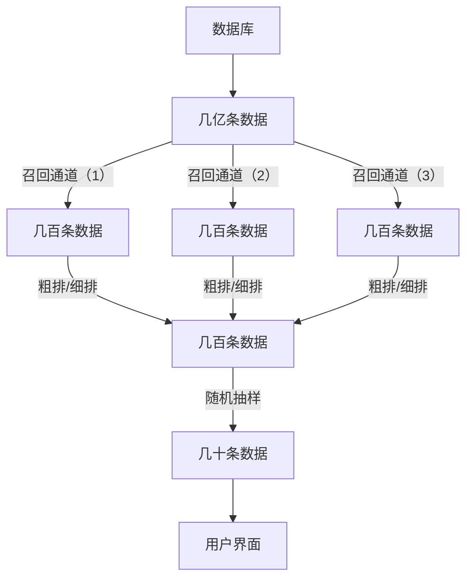

# 推荐系统设计


## 一、认识推荐系统


### 1、衡量推荐系统和和好坏的标准：北极星指标。

什么是北极星指标：北极星指标（North Star Metric），也叫作第一关键指标（One Metric That Matters），是指在产品的当前阶段与业务/战略相关的绝对核心指标，一旦确立就像北极星一样闪耀在空中，指引团队向同一个方向迈进（提升这一指标）。

主要北极星指标
- 日活数（DAD）/月活数（MAU）：每一个不同的用户使用一次系统，就记作一个日活数，同理对于月活数
- 消费（广义）：使用系统的时长，消费数额等
- 发布：用户的发布作品的数量


### 2、推荐系统基本流程


召回是为了快速减少数据量，方便后续筛选。

粗排和细排通过ai模型等快速对数据打分，粗派使用简单模型，减少时间，精排用复杂模型，提高精度，最后通过随机抽样来推送用户。

## 二、推荐系统的算法

### 1.基于物品的协同过滤(ItemCF)

ItemCF：物品协同过滤（Item-based Collaborative Filtering，简称 ItemCF）是一种基于物品相似性的推荐算法。它的核心思想是：如果用户喜欢某个物品，那么用户可能会喜欢与该物品相似的其他物品。

$$
\text{sim}(i, j) = \frac{\sum_{u \in U} r(u, i) \cdot r(u, j)}{\sqrt{\sum_{u \in U} r(u, i)^2} \cdot \sqrt{\sum_{u \in U} r(u, j)^2}}
$$


*举例子*

|      | ItemX  | ItemY  | ItemZ  |
|------|------|------|------|
| UserA  | 1    | 0    | 1    |
| UserB  | 1    | 1    | 0    |
| UserC  | 0    | 1    | 0    |

解释：有三位用户A,B,C，有三个物品X,Y,Z(1表示喜欢，0表示不喜欢)


$$
sin(X,Y) = \frac{1\cdot0+1\cdot1+0\cdot1}{\sqrt{1^2+1^2+0^2}\cdot\sqrt{0^2+1^2+1^2}} = \frac{1}{2}
$$

$$
sin(X,Z) = \frac{1\cdot1+1\cdot0+0\cdot0}{\sqrt{1^2+1^2+0^2}\cdot\sqrt{1^2+0^2+0^2}} = \frac{1}{\sqrt{2}}
$$

$$
sin(Y,Z) = \frac{0\cdot1+1\cdot0+1\cdot0}{\sqrt{0^2+1^2+1^2}\cdot\sqrt{1^2+0^2+0^2}} = 0 
$$

简单地，可以得到，计算物品x,y的相似度时，取Item的向量，$\vec{x}$ 和 $\vec{y}$，则

$$
\sin(\vec{x}, \vec{y}) = \frac{\vec{x} \cdot \vec{y}}{||\vec{x}||\cdot||\vec{y}||}
$$

python程序
```python
import numpy as np
def calc_similarity(x,y) :
    norm_x = np.linalg.norm(x)
    norm_y = np.linalg.norm(y)
    dot_xy = np.dot(x , y)
    if (norm_x == 0) or (norm_y == 0) :
        return 0 
    return dot_xy / (norm_x * norm_y) 
```

预估目标用户对于物品x的喜爱程度
$$
\text{like}(\text{user},\text{item}) = \sum_j \text{like}(\text{user}, \text{item}_j) \cdot \text{sim}(\text{item}_j, \text{item})
$$
返回几百条喜爱程度最大的数据，作为一个召回通道

### 2.Swing模型
$$
\text{sim}(x,y) = \sum_{u_1 \in \mathcal{V}} \sum_{u_2 \in \mathcal{V}} \frac{1}{a + \text{overlap}(u_1, u_2)} （a为非负超参数）
$$

*举例子*

|      | ItemX  | ItemY  |
|------|------|------|
| User1  | 1    | 1    | 
| User2  | 0    | 0    | 
| User3  | 0    | 0    | 


重叠矩阵为：
$$
\text{overlap} =
\begin{bmatrix}
2 & 1 & 1 \\
1 & 1 & 0 \\
1 & 0 & 1
\end{bmatrix}
$$

平滑参数设为：
$$
a = 1
$$

$$
\frac{1}{a + \text{overlap}(u_1, u_1)} = \frac{1}{1 + 2} = \frac{1}{3}
$$

$$
\frac{1}{a + \text{overlap}(u_1, u_2)} = \frac{1}{1 + 1} = \frac{1}{2}
$$

$$
\frac{1}{a + \text{overlap}(u_1, u_3)} = \frac{1}{1 + 1} = \frac{1}{2}
$$

类似地，其他用户对的贡献可以计算如下：

$$
\text{sim}(i_1, i_2) = \frac{1}{3} + \frac{1}{2} + \frac{1}{2} + \frac{1}{2} + \frac{1}{2} + 1 + \frac{1}{2} + 1 + \frac{1}{2}
$$

化简结果：
$$
\text{sim}(i_1, i_2) = \frac{1}{3} + \frac{5}{2} + 2 = \frac{1}{3} + \frac{10}{3} = \frac{11}{3}
$$

最终结果：
$$
\text{sim}(i_1, i_2) \approx 5.3333
$$

```python
def swing(X , a):
    sim = 0 
    for i in range(len(X)) :
        for j in range(len(X)) :
            useri = X[i] 
            userj = X[j]
            sim += 1 / (a + (useri[0] + userj[0] == 2) + (useri[1] + userj[1] == 2))
    return sim 
```